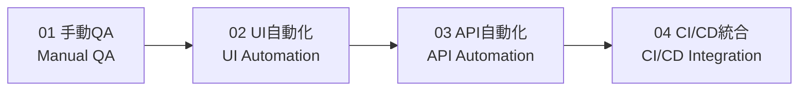
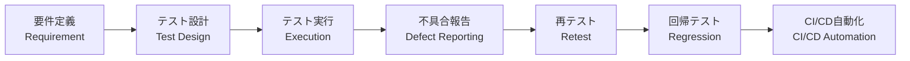
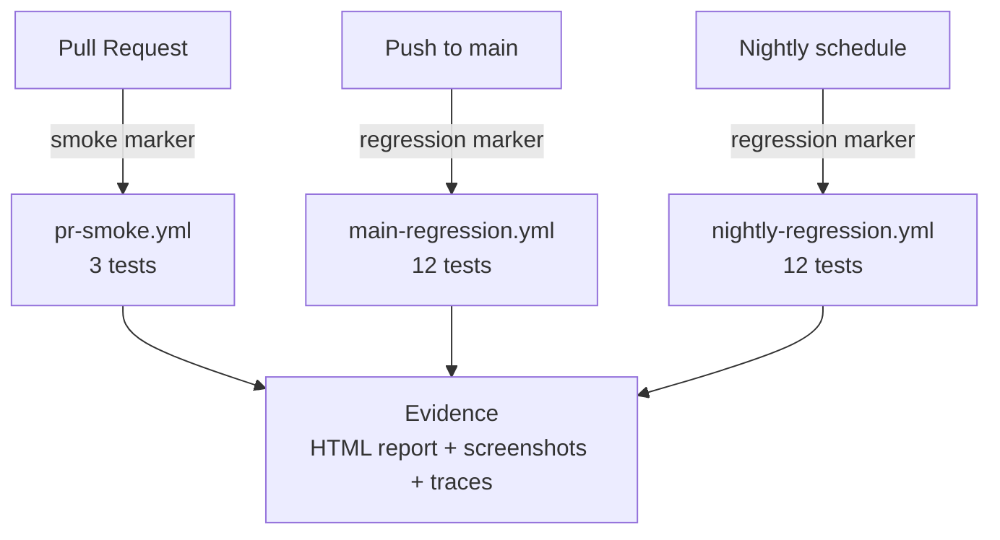

# タマン アミス Tamang Amish 👋

**QAエンジニアを目指しています | Aspiring QA Engineer**
ヘルプデスク／SEからQAへのキャリアチェンジ | Transitioning from Helpdesk/SE into QA Engineering

📍 横浜, 日本 / Yokohama, Japan　|　🌐 [github.com/amishanita](https://github.com/amishanita)　|　💼 [LinkedIn](https://www.linkedin.com/in/tamang-amish-669289250/)　|　✉️ amishmoktan2019@gmail.com

---

## 👔 採用担当者向けサマリー / Recruiter Summary

ITヘルプデスク／テクニカルサポート経験を持つ、QAエンジニア志望者です。

現在はITヘルプデスクとして問い合わせ対応、障害の一次対応、問題の切り分け・調査、技術文書作成を担当しています。

QAへのキャリアチェンジに向けて、Python・Playwright・pytest・Postman・GitHub Actionsを使った実践的なQAポートフォリオを4件構築しています。手動テスト → UIテスト自動化 → APIテスト → CI/CDまで、テスト設計と品質検証の実践力を段階的に身につけています。

日本国内でJunior QA Engineer / QA Engineerとして、ITサポートで培った問題解決力とQA・自動化スキルを活かしたいと考えています。

---

## 自己紹介 / About Me

**日本語：**
現在、株式会社アスパークにて社内システムのヘルプデスク業務を担当し、問い合わせ対応、障害の一次対応、手順書・障害報告書の作成を行っています。この「事象を正確に再現し、記録し、報告する」実務は、QAにおける不具合報告のプロセスと直結すると考え、QAエンジニアへのキャリア転換を進めています。

業務外でPython、pytest、Playwrightを独学し、手動テスト設計からUI自動化、API自動化、CI/CD統合まで、4件のテストプロジェクトを自分の手で構築し、GitHub上で公開しています。

**English:**
I currently work as IT Helpdesk/SE at a Japanese company, handling system inquiries, first-line incident response, and documentation (procedure guides, incident reports). That process, reproducing an issue accurately, recording it, and reporting it clearly, is directly transferable to QA defect reporting, which is why I'm transitioning into QA Engineering.

Outside of work, I self-studied Python, pytest, and Playwright, and built four QA portfolio projects covering manual test design, UI automation, API automation, and CI/CD integration, all published on GitHub.

---

## 技術スタック / Tech Stack

**テスト自動化 / Test Automation**

**CI/CD & バージョン管理 / CI/CD & Version Control**

**データベース・プロジェクト管理 / Database & PM Tools**

**開発補助AI / AI Dev Assist**

---

## スキルの積み上げ / Skill Progression

---

## QAワークフロー全体像 / End-to-End QA Workflow

---

## QAスキル一覧 / QA Skills at a Glance

| カテゴリ Category | スキル Skills | 根拠 Evidence |
|---|---|---|
| 手動テスト Manual QA | テストケース設計、要件トレーサビリティ、機能テスト / Test case design, requirements traceability, functional testing | Project 01 |
| UI自動化 UI Automation | Python, Playwright, pytest, Page Object Model | Project 02 |
| API自動化 API Testing | REST API, CRUD検証, アサーション, 不具合文書化 / CRUD coverage, assertions, defect docs | Project 03 |
| CI/CD | GitHub Actions, スモーク／回帰テスト分離 / smoke-regression separation | Project 04 |
| ツール Tools | Git, GitHub, Postman, SQL, Excel | 全プロジェクト共通 / all projects |

**箇条書きスキル一覧 / Skill Bullets**

- ✅ テストケース設計・要件トレーサビリティ / Test case design, requirements traceability
- ✅ 正常系・異常系テスト設計 / Positive & negative test design
- ✅ 境界値分析・同値分割 / Boundary value analysis, equivalence partitioning
- ✅ Python + Playwright + pytest によるUI自動化 / UI automation with Python, Playwright, pytest
- ✅ Page Object Model設計 / Page Object Model architecture
- ✅ REST API自動テスト（CRUD全体）/ REST API automation (full CRUD)
- ✅ JSON Schemaによる契約検証 / JSON Schema contract validation
- ✅ 認証・認可の境界値テスト / Auth boundary testing
- ✅ 再現可能な不具合報告（手順・期待値・実際値）/ Reproducible defect reports
- ✅ GitHub Actionsによるスモーク／回帰テスト自動化 / Smoke & regression automation via GitHub Actions
- ✅ フィクスチャ設計・スコープ管理 / Fixture design & scoping
- ✅ 実環境での不具合発見・修正経験 / Real defect diagnosis & fixes
- ✅ Postmanによる手動・探索的テスト / Manual & exploratory testing with Postman
- ✅ 日英バイリンガルQAドキュメント作成 / Bilingual QA documentation (EN/JA)

---

## QAポートフォリオ / QA Portfolio

| # | プロジェクト Project | 内容 What it shows | 技術 Tech | リンク |
|---|---|---|---|---|
| 01 | EC-CUBE 手動QA | 要件27件・テストケース40件・要件トレーサビリティマトリクス・日英併記 / 27 requirements, 40 test cases, requirements traceability matrix, bilingual docs | Excel, Markdown | [Repo](https://github.com/amishanita/01-eccube-manual-qa) |
| 02 | SauceDemo UI自動化 | Page Object Model、31件実行（Pass 30／Skip 1、理由明記）/ POM, 31 runs (30 pass, 1 skip, reason documented) | Python, Playwright, pytest | [Repo](https://github.com/amishanita/02-saucedemo-playwright-python) |
| 03 | RESTful Booker API | pytest 25ケース、不具合5件（再現エビデンス付き）/ 25 pytest cases, 5 documented defects with reproduction evidence | Python, pytest, Postman | [Repo](https://github.com/amishanita/03-restful-booker-api-automation) |
| 04 | SauceDemo CI/CD | 15件のテスト（スモーク3／回帰12）をCI/CD化、実行中に実バグ2件を発見・修正 / 15 tests (3 smoke, 12 regression) wired into CI/CD, 2 real defects found and fixed during setup | GitHub Actions, Playwright, pytest | [Repo](https://github.com/amishanita/04-saucedemo-ci-cd-qa) |

### 01 — EC-CUBE Manual QA

**日本語：** EC-CUBE（ECサイト）を対象とした手動テスト設計。要件27件からテストケース40件・テストシナリオ20件を設計し、要件トレーサビリティマトリクスを完備。iPhone実機（Chrome）でユーザー導線を実際に操作し、実スクリーンショット4枚を取得。バグは0件でしたが、1件の「不具合に見えた事象」を別ブラウザで検証し、環境要因であることを確認・記録しています。**これはテスト設計・実行の一部を示すポートフォリオであり、大規模な実行キャンペーンではないと明記しています。**

**English:** Manual test design against EC-CUBE. 40 test cases and 20 scenarios designed from 27 requirements, with a full requirements traceability matrix. Tested on a real iPhone (Chrome), with 4 real screenshots captured across the user flow. Zero bugs found — the demo site held up — but one thing that looked like a defect was investigated across browsers and confirmed as an environment issue, not a real bug, and documented as such. **Explicitly disclosed as a test-design portfolio, not a large-scale execution campaign.**

### 02 — SauceDemo UI Automation

**日本語：** SauceDemoを対象に、Python + Playwright + pytestでPage Object Modelを用いたUI自動化を構築。ログイン、カート、チェックアウトのフローを対象に31件実行し、Pass 30・Skip 1（理由を明記）。セレクタを1箇所に集約し、UI変更時の保守コストを最小化。

**English:** UI automation against SauceDemo using Python, Playwright, and pytest with a Page Object Model. Covers login, cart, and checkout flows. 31 runs executed, 30 passed, 1 intentionally skipped with the reason documented. Selectors centralized in page objects to minimize maintenance cost when the UI changes.

### 03 — RESTful Booker API Automation

**日本語：** RESTful Booker APIに対し、Python + pytestで25件のテストケースを自動化（認証6件、予約作成/取得8件、更新7件、削除4件）。仕様上の期待値でアサートし、実際の挙動と乖離した箇所は`xfail`として5件の不具合票にまとめ、curlでの再現エビデンスを添付。GitHub Actionsでpush・PR・毎晩の定期実行に対応。制約事項（性能・セキュリティテストは対象外、単一環境のみ等）も正直に明記。

**English:** 25 pytest cases against RESTful Booker's full CRUD lifecycle (6 auth, 8 booking, 7 update, 4 delete), asserting the specified behavior rather than whatever the API happens to do. 5 defects documented with curl reproduction evidence, marked `xfail` so a future fix turns the test green automatically. CI runs on push, PR, and nightly. Limitations (no performance/security testing, single environment) are disclosed directly in the repo rather than omitted.

### 04 — SauceDemo CI/CD

**日本語：** プロジェクト02のUI自動化（Page Object Model）を土台に、15件のテスト（スモーク3・回帰12）をCI/CDパイプラインに統合。PRごとのスモークテスト、mainへのpush時の回帰テスト、毎晩の定期回帰の3つのGitHub Actionsワークフローを構築。**構築中に実際のバグを2件発見し、自分で修正**：①フィクスチャのスコープ不一致によるセットアップ失敗、②`pytest-playwright`の出力フォルダ初期化がHTMLレポートの出力先を巻き込んで消去してしまう設定ミス。実アプリに対しローカルで15件全て成功（12.79秒）したことを確認済み。

**English:** Extends Project 02's Page Object Model automation into a CI/CD pipeline: 15 tests (3 smoke, 12 regression) across 3 GitHub Actions workflows — smoke gate on every PR, regression on push to main, and a nightly regression run. **Found and fixed 2 real defects while building it**: a fixture scope mismatch that failed every test at setup, and a config collision where Playwright's output-clearing behavior was silently wiping the HTML report's output folder before it could be written. Verified 100% pass rate locally against the live app (`15 passed in 12.79s`).

---

## CI/CDパイプライン（Project 04）/ CI/CD Pipeline

**実際に見つけて直したバグ2件 / 2 Real Bugs Found & Fixed:**
1. **日本語：** フィクスチャのスコープ不一致（`base_url`がfunction scope、必要なのはsession scope）で全テストがセットアップ時に失敗 → `scope="session"`で解消
   **English:** Fixture scope mismatch — `base_url` was function-scoped when session scope was required, failing every test at setup. Fixed by setting `scope="session"`.
2. **日本語：** `pytest-playwright`の`--output`フォルダ初期化処理が、HTMLレポートの出力先フォルダを巻き込んで削除してしまう設定ミス → 出力先を分離して解消
   **English:** `pytest-playwright`'s output-folder-clearing behavior was silently deleting the HTML report's output path before the report could be written. Fixed by separating the two output paths.

---

## テストへの取り組み方 / How I Approach Testing

- 要件ベースのテスト設計 / Requirement-based test design
- 正常系・異常系の両方をカバー / Positive and negative test coverage
- 再現可能な不具合報告（手順・期待結果・実際の結果を明記）/ Reproducible defect reporting
- スモークテストと回帰テストの使い分け / Smoke vs. regression separation
- スクリーンショット・レポート・トレースによる証跡ベースの実行 / Evidence-based execution

---

## 職務経歴（要約）/ Professional Background

**日本語：** 現在、株式会社アスパークにてITヘルプデスク／SEとして勤務。以前は製造業で15名のチームリーダー、携帯電話販売店舗で接客・契約業務を経験。

**English：** Currently IT Helpdesk/SE at a Japanese company. Prior experience: team leader for a 15-person team in manufacturing, and customer-facing sales/contracts at a mobile phone retailer.

詳細な職務経歴は職務経歴書をご参照ください。 / Full work history available in resume (職務経歴書) on request.

---

## 学習履歴（コース修了、資格ではありません）/ Learning History (Course Completions, Not Certifications)

- Quality Assurance Course（QA基礎・手動テスト・機能テスト・回帰テスト）
- Master Software Testing + Jira + Agile on Live App
- Python SDET-BackEnd / REST API Automation from Scratch
- Playwright Python Automation Testing - From Zero to Expert
- Learn SQL in Practical + Database Testing from Scratch
- Learn GIT In Depth with BitBucket - Practical Work Flows
- Agile Scrum Foundation
- Agile Scrum Master

**正式な資格 / Formal Qualification:** JPT（日本語能力試験）ビジネスレベル / JPT (Japanese Proficiency Test) — Business Level

**受験予定 / Exam Scheduled:** ISTQB Foundation Level（CTFL）— 2026年11月11日 受験予定 / ISTQB CTFL exam scheduled for November 11, 2026 (in preparation, not yet certified)

---

## 語学 / Languages

| 言語 Language | レベル Level |
|---|---|
| 日本語 Japanese | ビジネスレベル / Business Level (JPT) |
| 英語 English | ビジネスレベル / Conversational-Business |
| ネパール語 Nepali | ネイティブ / Native |
| ヒンディー語 Hindi | 会話レベル / Conversational |

---

## 希望職種 / Career Focus

日本国内での以下のポジションを希望しています / Seeking opportunities in Japan as:
- QAエンジニア / QA Engineer
- Junior QAエンジニア / Junior QA Engineer
- ソフトウェアテスター / Software Tester
- テストエンジニア / Test Engineer
- QAアナリスト / QA Analyst
- UATテスター / UAT Tester
- 品質保証担当 / Quality Assurance

---

## 連絡先 / Contact

- GitHub: [github.com/amishanita](https://github.com/amishanita)
- LinkedIn: [linkedin.com/in/tamang-amish](https://www.linkedin.com/in/tamang-amish-669289250/)
- Email: amishmoktan2019@gmail.com

> 💬 すべてのプロジェクトは自分の手で構築・実行・文書化したものです。リンク先は実際のリポジトリです。
> All projects above were built, run, and documented by hand — links go to the actual repositories.
